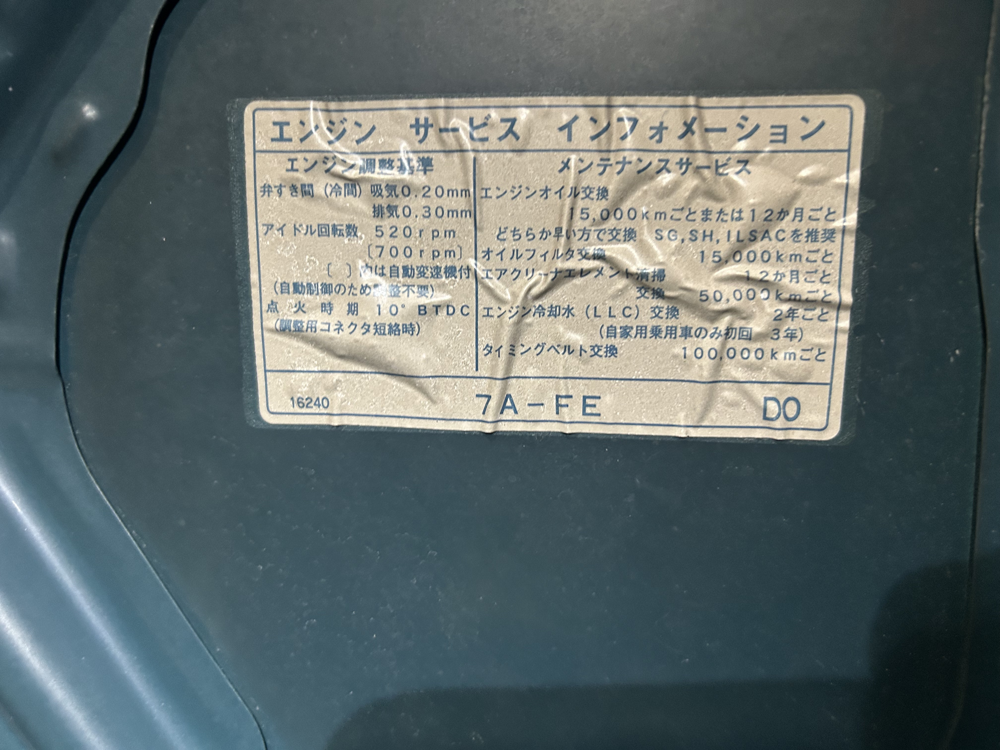

I've noticed the idle is a little "buzzy" or bumpy when it is either idling above or below ~700 RPM

[Chris Fix "How to Fix a Car that Idles Poorly (Rough Idle)"](https://www.youtube.com/watch?v=KhvqT3blzVs)

https://toyota.epc-data.com/sprinter_carib/ae115g/19254/engine/2211/22270/

https://www.youtube.com/watch?v=0tpSmaRqxsc

[Idle air control valve on ebay](https://www.ebay.com/itm/357624151418?chn=ps&norover=1&mkevt=1&mkrid=711-173151-913341-5&mkcid=2&mkscid=101&itemid=357624151418&targetid=&device=c&mktype=pla&googleloc=9032934&poi=&campaignid=23518448872&mkgroupid=&rlsatarget=&abcId=10414378&merchantid=5587722854&gad_source=1&gad_campaignid=23513748158&gbraid=0AAAAAD_QDh8NE_RO2KZ-uTNUiJ1qoY3fC&gclid=Cj0KCQiAhaHMBhD2ARIsAPAU_D724rhFw4p5pXE86V-0iyQdTlURG3tJEqV6WoScDUtPldzMeV1R2N4aAokvEALw_wcB) 78$

Apparently you can hook up a power source to one of the pins and ground to the other to watch the idle control open/close when it is disconnected from the car.

### 2/8/2026
I purchased the following gaskets from https://autoparts.beavertontoyota.com/. They can be picked up in beaverton which is super convienient. It makes sense to replace the gaskets since they are definitely something that degrade over time. Once they come in, I'll buy some throttle body cleaner, and take the throttle body off, clean it, then take the IAC off, and test it.
I should get some 8mm bolts prior to this so I can plug the coolant lines that attach to the throttle body. I should also remember to tape off air intake lines as to not get gunk in them.

| name                 | part number     |
| -------------------- | --------------- |
| throttle body gasket | **22271-15020** |
| IAC gasket           | **22215-74400** |

22 Nm torque spec for the screws that go into the throttle body
### 2/8/2026
I cleaned the IAC valve and the throttle body, and the engine still idles at 500-550 RPM when stopped at a light which makes it a bit buzzy and vibrates. On the hood, it shows the idle speed is between 520 and 700 RPM.

https://www.reddit.com/r/COROLLA/comments/1ebjnt5/1996_toyota_corolla_shaking_when_idle/
This says maybe replacing the spark plugs would help
https://www.youtube.com/watch?v=lQMDhaXTjCY
Maybe it is the motor mounts
https://www.toyotanation.com/threads/toyota-corolla-ae102-shaking-when-idling.1720710/page-2?nested_view=1
Seems like maybe I can run a compression test to see if that is an issue?

### 2/22/2026

gonna try to do this, according to[ this video](https://www.youtube.com/watch?v=LOrQ9TilfOg) it will only work on 00s and after models so I am not super hopeful.
1. Get engine up to temp (half way up the temp gague)
2. turn all loads off
3. turn off
4. turn on
5. turn off
6. turn on
7. then turn the engine all the way on
8. apply the handbrake
9. press the foot brake and shift into drive
10. sit there for 5 mins.